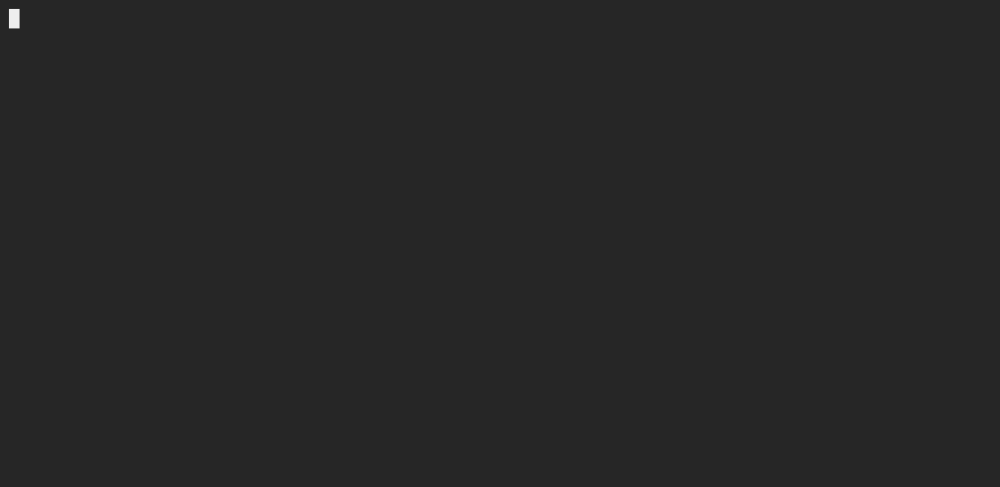
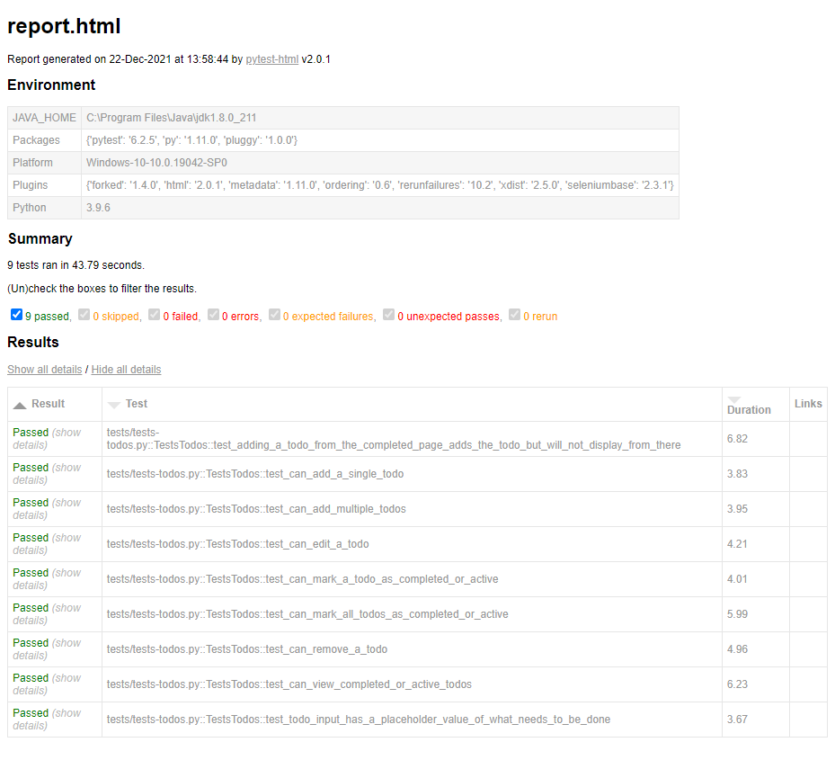

# ToDoMVC React Automated Checks using Python and SeleniumBase

## Running SeleniumBase UI Tests

### Dependencies

* [SeleniumBase](https://seleniumbase.io/)
* SeleniumBase driver for your desired browser. Run `seleniumbase install chromedriver` for *Google Chrome* or `seleniumbase install geckodriver` for *Firefox*.

If you're having trouble installing *SeleniumBase* on a Mac because the version of Python is < 3.0, [this](https://seleniumbase.io/other/py_virtual_envs.html) could help you:

1. Install Python3 if you don't yet have one.
2. Create a Python virtual environment for the project by running `python3 -m venv ENV_NAME`.
3. Activate the created virtual environment. Run `source ENV_NAME/bin/activate`.
4. Update pip. Run `pip install --upgrade pip`.
5. Install Seleniumbase. Run `pip install seleniumbase`.

---

### Headlessly

1. Open a web browser. Go to the remote code repository (<https://github.com/jasonogayon/autochecks-py-seleniumbase>) and copy its SSH or HTTPS link.

2. On your machine, open a terminal and clone the remote repository locally wherever you want. Run `git clone git@github.com:jasonogayon/autochecks-py-seleniumbase.git`.

3. After that, go inside the cloned **autochecks-py-seleniumbase** repository. You can decide to rename this directory to what you want.

4. Now we can run our tests locally on our machine. Run `make h`.

---

### With Browser Launching

1. Follow the same steps 1-3 above.

2. Run `make ui`

---

### With Visual Checks

The default headless or with browser test runs do not check for visual differences from a baseline. If you want the visual checks triggered as well, run either `make hv` or `make uiv`.

---

### On Demo Mode

SeleniumBase has a neat *demo mode* feature. The tests will highlight the elements that are targetted for every step. To run the tests on this mode:

1. Follow the same steps 1-3 above.

2. Run `make demo`

---

### Via Browserstack

1. Follow the same steps 1-3 above.

2. Create a Browserstack account, and get your Automate user name and access key when you're signed in.

3. A default browser desired capabilities file can be found on the **capabilities/browserstack.py** file. Review and update it according to your requirements. You can use Browserstack's [Capabilities Generator](https://www.browserstack.com/automate/capabilities) for this purpose.

4. Run the tests by running `make bs user={your_user} key={your_key}`

---

### Reports

Running the tests on whatever mode generates a test report in HTML format, found inside the **report** directory. If there any one test fails, a screenshot of where the failure occured is automatically included in the report.

Author: Jason B. Ogayon \
Software Engineer and Software Tester
